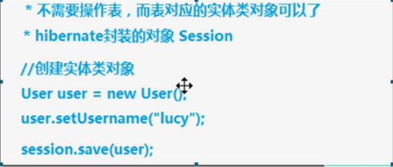

# JavaEE 三层结构
1、web层  （struts框架用于web层）  
2、service层  （spring框架用于service层）  
3、dao层 持久化层（hibernate框架）  
dao层就是对数据库进行【增删改查】操作

#Hibernate
1、什么是框架：  
写程序，用框架之后，替我们实现一部分功能，使用框架的好处是少写一部分代码就能实现功能。  

 2、什么是hibernate框架：  
hibernate这个单词是冬眠的意思  
hibernate用在javaee的dao层，实现对数据库的增删改查操作  
底层代码就是jdbc，hibernate对jdbc进行了封装  
用hibernate的好处就是不需要写复杂的jdbc代码了，甚至不需要写sql语句就能实现一些功能  

3、是开源的轻量级框架
不需要依赖其他的东西就可以用，导入的jar包也比较少

4、hibernate版本
现在用hibernate5.X

#orm思想
1、hibernate使用orm思想读数据库进行crud（增删改查）操作  
2、orm：object relational mapping ---对象映射关系  
1）让实体类跟数据库表进行一一对应
实体类和表对应
类中的属性和表中的字段对应
2）不需要操作数据库，只需要操作实体类对象

 
 #搭建hibernate环境
 1、导入jar包  
 
 

