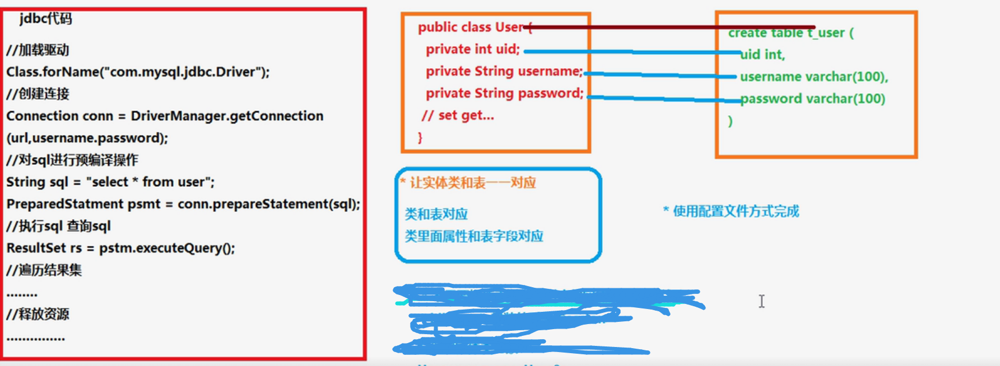
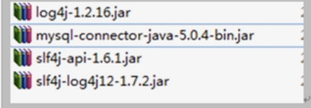
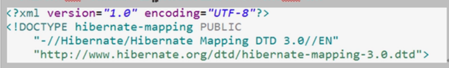

# JavaEE 三层结构
1、web层  （struts框架用于web层）  
2、service层  （spring框架用于service层）  
3、dao层 持久化层（hibernate框架）  
dao层就是对数据库进行【增删改查】操作

#Hibernate
1、什么是框架：  
写程序，用框架之后，替我们实现一部分功能，使用框架的好处是少写一部分代码就能实现功能。  

 2、什么是hibernate框架：  
hibernate这个单词是冬眠的意思  
hibernate用在javaee的dao层，实现对数据库的增删改查操作  
底层代码就是jdbc，hibernate对jdbc进行了封装  
用hibernate的好处就是不需要写复杂的jdbc代码了，甚至不需要写sql语句就能实现一些功能  

3、是开源的轻量级框架
不需要依赖其他的东西就可以用，导入的jar包也比较少

4、hibernate版本
现在用hibernate5.X

#orm思想
1、hibernate使用orm思想读数据库进行crud（增删改查）操作  
2、orm：object relational mapping ---对象映射关系  
1）让实体类跟数据库表进行一一对应
实体类和表对应
类中的属性和表中的字段对应
2）不需要操作数据库，只需要操作实体类对象

 
 
 
 
 #搭建hibernate环境
 第一步：导入jar包  
 
 使用hibernate的时候，有日志信息输出，但是hibernate本身没有日志输出的jar包，所以要导入其他日志的jar包
  
 不要忘记还有mysql驱动的jar包  
 
  
  第二步：创建实体类entity和数据库中的表
  要求实体类中有一个属性是唯一的，通常用表的主键id
  * 不需要自己手动创建数据库中的表，hibernate帮忙创建
  
  第三步：配置实体类和数据库表一一对应关系（映射关系）  
  使用配置文件实现映射关系  
  1）创建xml格式配置文件
  名称和位置无固定要求  
  建议：在实体类所在包中创建，实体类名称.hbm.xml
  2)配置文件是xml格式，在配置文件中首先引入xml约束：dtd约束
 
 

